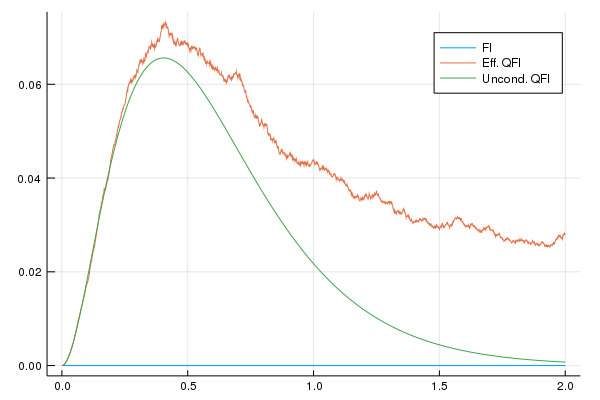

# ContinuousMeasurementFI-GPU

## AIM

When the operators get large, a parallelization of the linear algebra operations over kilo-cores devices, in place of the parallelization over the number of trajectories, may lead to substantial advantage.

Here we provide a GPU implementation of the Continuous-MeasurementFI-dicke algorithm.

Keywork: CuArrays.

## Installation

Requires Julia v1.0.

From the Julia REPL, open the package manager with the key `]` and run the command

```julia
pkg> add https://github.com/matteoacrossi/ContinuousMeasurementFI#dicke
```

This will install all the dependencies, including a Python environment with [QuTiP](http://www.qutip.org).

To make local changes to the package, use

```julia
pkg> dev ContinuousMeasurementFI
```

## Usage

This will evaluate the effective QFI for 3 spins with 100 trajectories and compare it with the unconditional dynamics

```julia
using ContinuousMeasurementFI

result = Eff_QFI_HD_Dicke(3, 100, 2., 0.001)

result_uncond = Unconditional_QFI_Dicke(3, 2., 0.001)
```

This will produce the following plot
```julia
using Plots
plot(result.t, result.FI, label="FI")
plot!(result.t, result.FI + result.QFI, label="Eff. QFI")
plot!(result_uncond.t, result_uncond.QFI, label="Uncond. QFI")
```




`result` also contains the expectation values for the global operators `jx`, `jy`, `jz` and their variances `Δjx`, `Δjy`, `Δjz`,
and a `timer` object showing detailed timing information.
